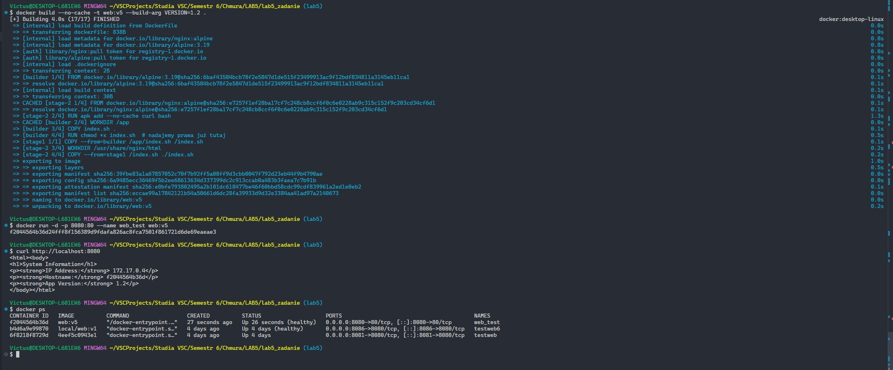

# Laboratorium 5 - Dockerfile z Scratch i Nginx

- **Treść utworzonego pliku Dockerfile:**

```dockerfile
# STAGE 1: build
FROM alpine:3.19 AS builder

ARG VERSION=1.0
ENV APP_VERSION=$VERSION

WORKDIR /app
COPY index.sh .
RUN chmod +x index.sh

# STAGE 2: scratch
FROM scratch AS stage1
COPY --from=builder /app/index.sh /index.sh

# STAGE 3: nginx
FROM nginx:alpine

ARG VERSION
ENV APP_VERSION=$VERSION

RUN apk add --no-cache curl bash

WORKDIR /usr/share/nginx/html
COPY --from=stage1 /index.sh ./index.sh

EXPOSE 80

CMD ["sh", "-c", "./index.sh && nginx -g 'daemon off;'"]

HEALTHCHECK --interval=30s --timeout=5s --start-period=5s \
  CMD curl -f http://localhost || exit 1
```

- Polecenie do budowy obrazu i wynik:
```docker build -t web:v5 --build-arg VERSION=1.2 .```

- Wynik builda
```[+] Building 4.0s (17/17) FINISHED```

- Polecenie uruchamiające serwer:
```docker run -d -p 8080:80 --name web_test web:v5```

- Polecenie potwierdzające działanie kontenera i funkcjonowanie aplikacji:
```curl http://localhost:8080```
- wynik
```<html><body>
<h1>System Information</h1>
<p><strong>IP Address:</strong> 172.17.0.4</p>
<p><strong>Hostname:</strong> f2044564b36d</p>
<p><strong>App Version:</strong> 1.2</p>
</body></html>```

